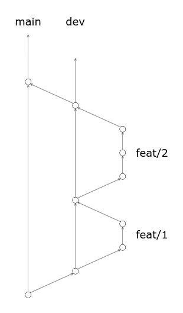

# Word Counter

## Общее описание
Сразу после открытия приложение запрашивает у пользователя текст произвольной длины и выводит его на экран.
После ввода в отдельном блоке автоматически отображается статистика по введённому тексту. Статистика включает следующую информацию:
 * Количество символов с пробелами;
 * Количество символов за исключением пробелов;
 * Количество слов,
 * Количество знаков препинания.

## Внешний вид
На экране должно быть два отдельных поля: в одном отображается введённый пользователем текст, а в другом — статистика. В остальном — на свой вкус.

## Развёртывание
Приложение должно быть развёрнуто и доступно публично на любом бесплатном хостинге — GitHub Pages, Cloudflare Pages и т.п.

## Code of Conduct
### Branching strategy

`main` is for production-ready version of the code. Direct commit to the `main` is forbidden.

`dev` is branched from `main`, it contains intermediate results of the team's work.

All work is carried out in the so-called feature branches that are branched from `dev` when work on an issue is started and merged back into `dev` when work is completed.

Please name feature branches using template `{type}/{issue-number}`, for example: `docs/15`, `feat/7`, `fix/10`.

Schematic branching diagram:



### Commits

Please use [Conventional Commits](https://www.conventionalcommits.org/) rules when committing.

Always refer to the related issue in the commit footer when closing issue ([more details→](https://docs.github.com/en/issues/tracking-your-work-with-issues/linking-a-pull-request-to-an-issue#linking-a-pull-request-to-an-issue-using-a-keyword)):

```plain
docs: add Code of Conduct

extend `README.md` with a Code of Conduct

Closes #15

```

💡 You could use [Commitlint](https://commitlint.io/) as helper while writing commit message.

### Pull requests

Be short, descriptive, polite. Read [this](https://github.blog/2015-01-21-how-to-write-the-perfect-pull-request/) for inspiration.

Any pull request should be approved by at least one person (except you 👻) before merging.
